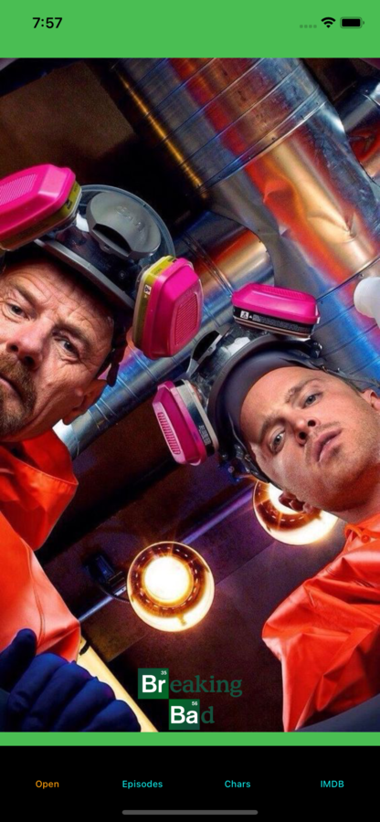

# fourth-week-homework

# WARNING : While doing the homework, I used version 13.4.1 of Xcode 

1- https://breakingbadapi.com/  API kullanılarak bir uygulama geliştirilecektir. Aşağıda detaylar verilmiştir.
--

• Uygulama tablı yapıda olacaktır.(Açılış tabbar) ve 3 ayrı tab olacaktır.
• Activity indicator kullanılmalıdır.
• Alert gösterimi yapılmalıdır.

## Giriş Ekranı

## 1.Tab - Karakterler:

## 3.Tab- IMDB Sayfası
 

2- Clean Code - 1, 2, 3, 4 chapterlar özetlenmelidir.
--

Kolay gelsin :)
